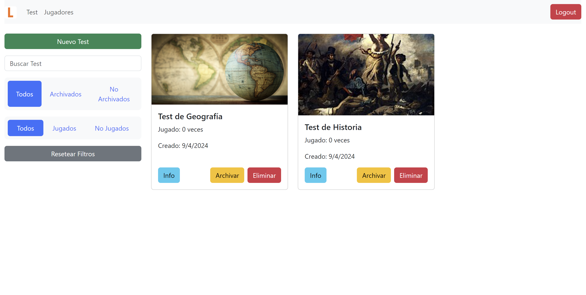
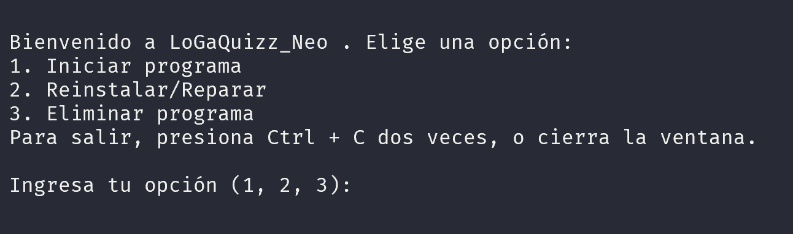

# LoGaQuizz Neo 🎓 

Aplicación educativa interactiva y versátil que mejora la experiencia de aprendizaje de los estudiantes y facilita las tareas de enseñanza para los profesores en un entorno digital



## ✅ Requisitos Previos

Antes de comenzar, asegúrate de tener instalado lo siguiente:
- [Node.js y npm](https://nodejs.org/es/): Necesarios para el desarrollo del frontend con React.
- [Python](https://www.python.org/downloads/): Necesario para ejecutar el backend con FastAPI.
- [Git](https://git-scm.com/downloads) (opcional): Recomendado para el control de versiones.

## 📂 Estructura del Proyecto

El proyecto se divide en dos partes principales:

- `frontend`: Contiene la interfaz de usuario desarrollada con React.
- `backend`: Contiene el servidor API desarrollado con FastAPI.

## 🔧 Configuración del Entorno de Desarrollo

### 🚀 Frontend

1. **Navega al directorio del frontend** 
   ```
   cd LoGaQuizz_Neo/frontend
   ```

2. **Instala las dependencias de React** 
   ```
   npm install
   ```

### 🔌 Backend

1. **Navega al directorio del backend** 
   ```
   cd LoGaQuizz_Neo/backend
   ```

2. **Opción A: Uso de un entorno virtual (recomendado)**
   - **Creación del entorno virtual**
     ```
     python3 -m venv venv
     ```
   - **Activación del entorno virtual**
     ```
     source venv/bin/activate
     ```
   - **Instalación de dependencias**
     ```
     pip install -r requirements.txt
     ```

3. **Opción B: Instalación directa de dependencias**
   ```
   pip install -r requirements.txt
   ```

## 💡 Uso
Para usar "LoGaQuizz_Neo", debes tener ambos servidores, el del frontend y el del backend, corriendo en paralelo. 

### 🏁 Puesta en marcha

1. **Iniciar el servidor de backend**  
   Navega al directorio `backend` y ejecuta el servidor FastAPI con:
   ```bash
   python app/main.py
   ```
   Esto iniciará el servidor API.

2. **Iniciar el servidor de frontend**
   En una nueva terminal, navega al directorio `frontend` y ejecuta:
   ```bash
   npm start
   ```
   Esto iniciará el servidor de desarrollo de React y abrirá la aplicación en tu navegador por defecto.

### 🔑 Administración

- El administrador debe iniciar sesión con sus credenciales para gestionar la aplicación.
- Antes de que los jugadores puedan conectarse, el administrador necesita iniciar un juego.

### 🌐 Conexión de los Jugadores

- Los jugadores deben estar conectados a la misma red que el ordenador que ejecuta los servidores.
- Para acceder a la aplicación, el administrador debe revisar y cambiar el valor de la IP local (`{local_ip}`) que está en el archivo `frontend/.env`. Los jugadores deben navegar a `http://{local_ip}:3000/` en su navegador web.

### 📊 Funcionalidades

La aplicación "LoGaQuizz_Neo" permite:

- **Gestión de pruebas**: Ver, crear, editar y eliminar pruebas.
- **Gestión de jugadores**: Ver y eliminar jugadores.
- **Resultados**: Consultar los resultados de cada jugador y de cada prueba.
- **Jugar**: Iniciar y jugar una prueba.

Asegúrate de que todos los usuarios tengan acceso a la red adecuada y comprendan cómo conectar sus dispositivos para participar.

## 🌟 Launcher



Se ha simplificado el proceso de instalación y ejecución con un launcher que puedes descargar desde la sección de `Releases`.  
Para utilizarlo, siga las siguientes instrucciones:

1. **Descargar el Launcher**
Ve a la sección de `Releases` de nuestro repositorio y descarga el archivo `.exe` del launcher.

2. **Ejecutar el Launcher**
Una vez descargado, ejecuta el archivo `.exe`. El launcher automáticamente configurará el entorno, instalará las dependencias necesarias y pondrá en marcha los servidores de frontend y backend.

## 📜 Licencia
Este proyecto está licenciado bajo la Licencia MIT.

La Licencia MIT permite el uso, copia, modificación, fusión, publicación, distribución, sublicenciamiento y/o venta de copias del software, y permite que las personas a quienes se les proporciona el software lo hagan también, bajo ciertas condiciones.

Para más información, vea el archivo `LICENSE` incluido con este proyecto o visite [https://opensource.org/licenses/MIT](https://opensource.org/licenses/MIT).
